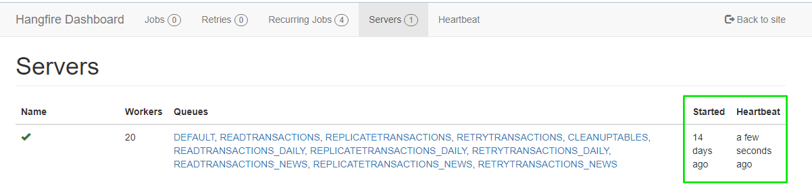
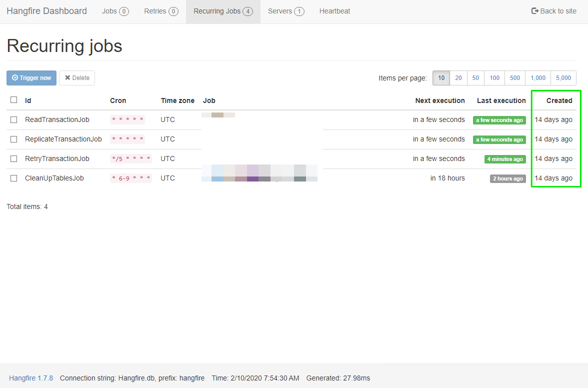
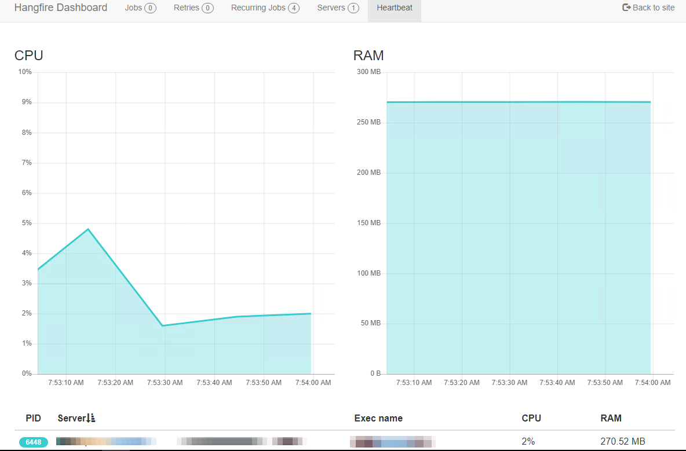

# Hangfire.Storage.SQLite
[](https://www.nuget.org/packages/Hangfire.Storage.SQLite)
[](https://github.com/raisedapp/Hangfire.Storage.SQLite/actions)
[](https://github.com/raisedapp/Hangfire.Storage.SQLite/actions)
[](http://hangfire.io)
[](http://opensource.org/licenses/MIT)

## Overview

An Alternative SQLite Storage for Hangfire.

This project was created by abandonment **Hangfire.SQLite** storage (https://github.com/wanlitao/HangfireExtension), as an alternative to use SQLite with Hangfire.

Is production ready? **Yes**








## Installation

Install a package from Nuget.

```
Install-Package Hangfire.Storage.SQLite
```

## Usage

This is how you connect to an SQLite instance
```csharp
GlobalConfiguration.Configuration.UseSQLiteStorage();
```

### Example

```csharp
services.AddHangfire(configuration => configuration
            .UseSimpleAssemblyNameTypeSerializer()
            .UseRecommendedSerializerSettings()
            .UseSQLiteStorage());
```

## Options

In the UseSQLiteStorage method you can use an instance of the Hangfire.Storage.SQLite.SQLiteStorageOptions class to specify some options of this plugin.

Below is a description of them:

`Option` | `Default Value`
--- | ---
**QueuePollInterval** |  **TimeSpan.FromSeconds(15)**
**InvisibilityTimeout** |  **TimeSpan.FromMinutes(30)**
**DistributedLockLifetime** | **TimeSpan.FromSeconds(30)**
**JobExpirationCheckInterval** | **TimeSpan.FromHours(1)**
**CountersAggregateInterval** | **TimeSpan.FromMinutes(5)**
**AutoVacuumSelected** | **AutoVacuum.NONE**, other options: **AutoVacuum.Full** or **AutoVacuum.Incremental**
**RecurringAutoCleanIsEnabled** | **false**, It needs to be enabled (**true**), so that it is executed at every ExpirationManager execution.

## Thanks

This project is mainly based on **Hangfire.LiteDB** storage by [@codeyu](https://github.com/codeyu) (https://github.com/codeyu/Hangfire.LiteDB)

## Donation
If this project help you reduce time to develop, you can give me a cup of coffee :) 

[](https://www.paypal.com/cgi-bin/webscr?cmd=_donations&business=RMLQM296TCM38&item_name=For+the+development+of+Hangfire.Storage.SQLite&currency_code=USD&source=url)

## License
This project is under MIT license. You can obtain the license copy [here](https://github.com/raisedapp/Hangfire.Storage.SQLite/blob/develop/LICENSE).
